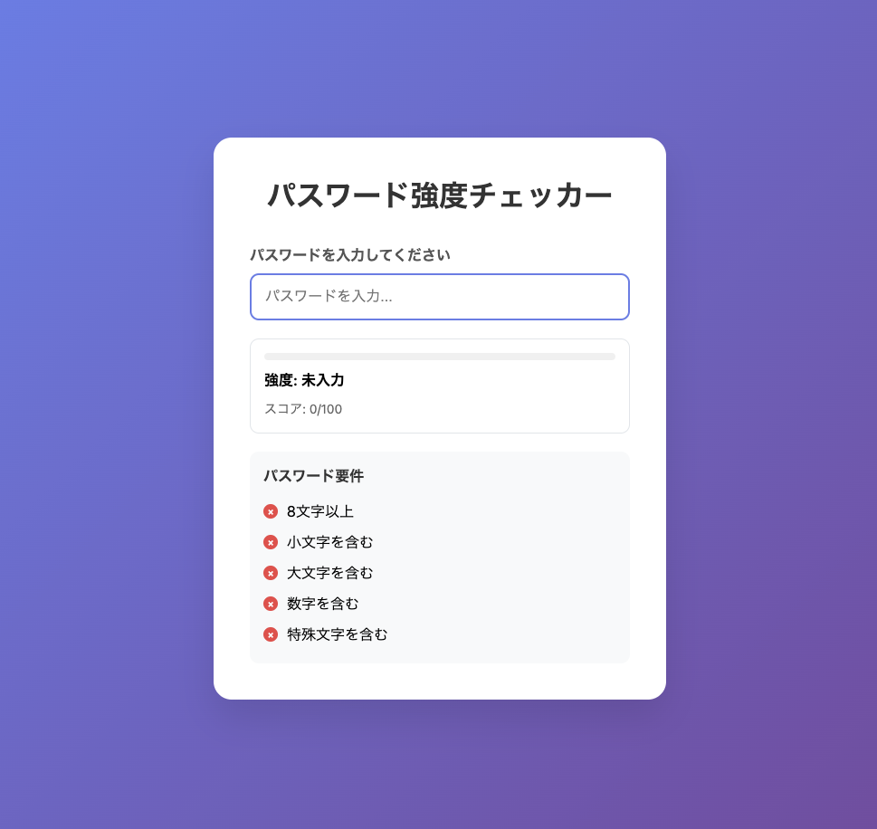
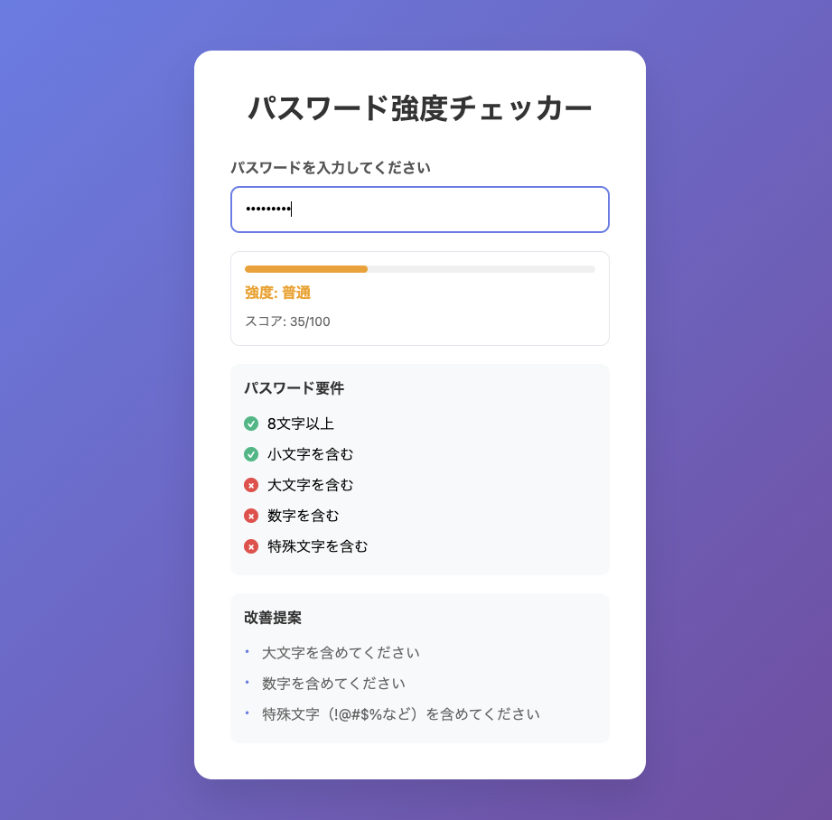
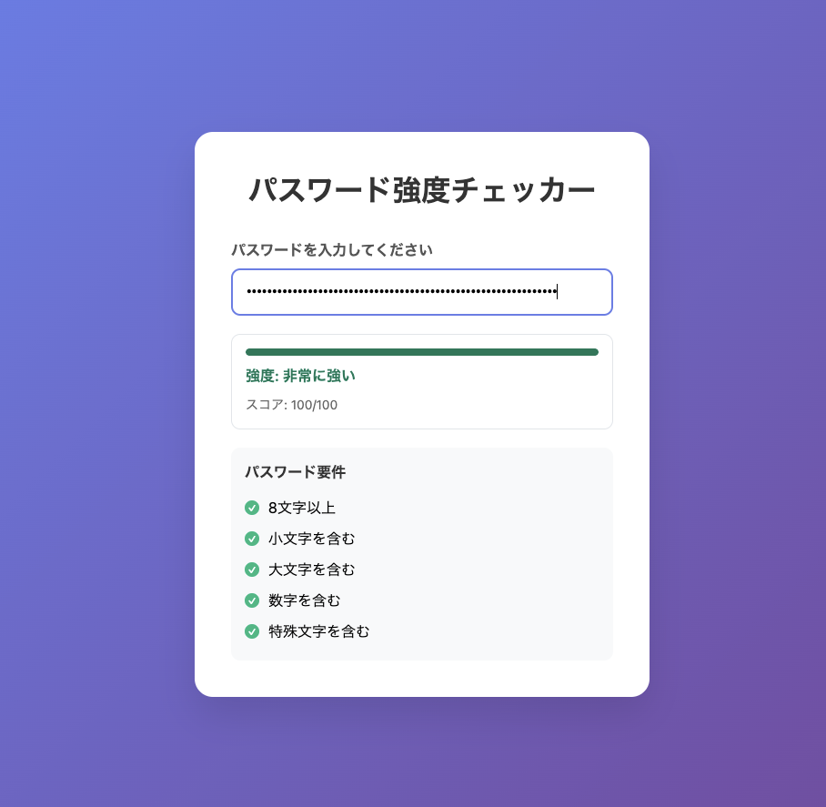

# Day 003: パスワード強度チェッカー

## 概要
入力されたパスワードを正規表現とシンプルなルールでスコアリングし、強度を判定してアドバイスを表示するWebアプリケーションです。

## 機能

### 🔍 パスワード強度判定
- **リアルタイム評価**: 入力と同時に強度を判定
- **5段階評価**: 弱い → 普通 → 良い → 強い → 非常に強い
- **スコア表示**: 0-100点でパスワードの強度を数値化

### 📊 視覚的インジケーター
- **プログレスバー**: 強度に応じた色分け表示
- **要件チェックリスト**: 各条件の達成状況を表示
- **カラーコード**: 強度レベルに応じた色分け

### 🎯 スコアリングルール

#### 基本要件（各15-20点）
- **文字数**: 8文字以上（20点）
- **小文字**: a-z を含む（15点）
- **大文字**: A-Z を含む（15点）
- **数字**: 0-9 を含む（15点）
- **特殊文字**: !@#$%^&*()_+-=[]{};"\\|,.<>/? を含む（15点）

#### 追加ボーナス
- **長さボーナス**: 12文字以上（+10点）、16文字以上（+10点）
- **多様性ボーナス**: ユニークな文字が70%以上（+5点）

#### ペナルティ
- **連続文字**: 同じ文字が3回以上連続（-10点）
- **連続パターン**: 123、abc、qweなどの連続（-10点）
- **一般的パターン**: password、123456、qwerty、admin、loginなど（-20点）

### 💡 改善提案機能
パスワードの弱点を分析し、具体的な改善提案を表示：
- 文字数の不足
- 文字種別の不足
- 危険なパターンの使用

## 技術仕様

### 使用技術
- **HTML5**: セマンティックなマークアップ
- **CSS3**: モダンなデザイン、グラデーション、レスポンシブ対応
- **JavaScript**: 正規表現による文字種別判定、リアルタイム評価

### 正規表現パターン
```javascript
// 基本的な文字種別チェック
const criteria = {
    length: password.length >= 8,
    lowercase: /[a-z]/.test(password),
    uppercase: /[A-Z]/.test(password),
    number: /\d/.test(password),
    symbol: /[!@#$%^&*()_+\-=\[\]{};':"\\|,.<>\/?]/.test(password)
};

// 危険なパターンの検出
const consecutiveChars = /(.)\1{2,}/.test(password);
const sequentialPattern = /123|abc|qwe/i.test(password);
const commonPatterns = [/password/i, /123456/, /qwerty/i, /admin/i, /login/i];
```

## デザイン特徴

### UI/UX
- **クリーンなデザイン**: 見やすく直感的なインターフェース
- **レスポンシブ**: モバイル・デスクトップ対応
- **アクセシビリティ**: 色覚に配慮したカラーパレット

### カラーパレット
- **弱い**: #ef4444 (赤)
- **普通**: #f59e0b (オレンジ)
- **良い**: #10b981 (緑)
- **強い**: #059669 (濃い緑)
- **非常に強い**: #047857 (最も濃い緑)

## 使用方法

1. **ファイルを開く**
   ```bash
   open index.html
   ```

2. **パスワードを入力**
   - テキストフィールドにパスワードを入力
   - リアルタイムで強度が評価される

3. **結果を確認**
   - 強度バーで視覚的に確認
   - 要件チェックリストで詳細を確認
   - 改善提案を参考に最適化

## セキュリティ考慮事項

- **クライアントサイド処理**: パスワードはサーバーに送信されない
- **一時的な処理**: 入力データは保存されない
- **教育目的**: 実際のパスワード管理には専門ツールを推奨

## 改善可能な点

- **辞書攻撃対策**: 一般的な単語の検出
- **パスフレーズ対応**: 長い文章形式のパスワード評価
- **多言語対応**: 日本語を含む他言語の文字種別判定
- **エントロピー計算**: より高度な強度計算アルゴリズム

## 画像




