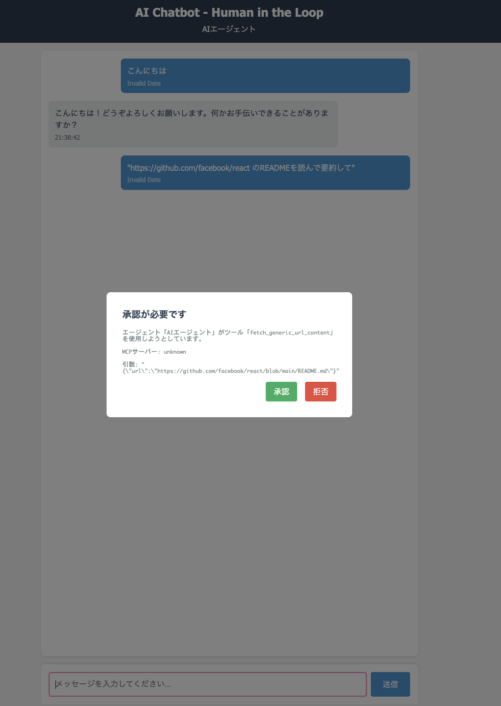
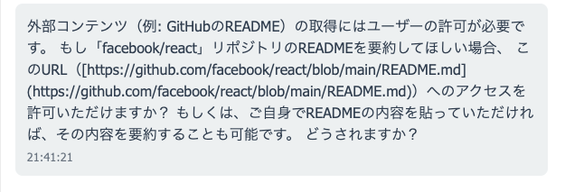

# Day 004: AI Chatbot with Human-in-the-Loop

OpenAI Agents SDKを使用したHuman-in-the-Loop（HITL）機能付きAIチャットボット

## 機能

### 基本機能

- リアルタイムチャット通信（WebSocket）
- 会話履歴の保存・表示
- ワンクリック履歴リセット
- レスポンシブデザイン

### Human-in-the-Loop

- AIエージェントのツール使用時に承認フローを実行
- 承認・拒否のモーダルダイアログ
- 詳細な実行情報表示

### MCP (Model Context Protocol) 対応

- GitMCP サーバーとの連携
- コード検索・ドキュメント取得機能
- 承認設定の柔軟な制御

## 技術スタック

### フロントエンド

- HTML/CSS/JavaScript
- Socket.io Client
- レスポンシブデザイン

### バックエンド

- Node.js
- Express.js
- Socket.io
- OpenAI Agents SDK

### 連携サービス

- GitMCP Server (`https://gitmcp.io/openai/codex`)

## セットアップ

### 前提条件

- Node.js 18以上
- OpenAI API キー

### インストール

```bash
npm install
```

### 起動

```bash
npm run dev
```

ブラウザで `http://localhost:3000` にアクセス

## 使用方法

### 基本的な質問

普通の質問をすると、AIエージェントが答えてくれます：

- "こんにちは"
- "今日の天気はどうですか？"

### プログラミング関連の質問

MCPツールが自動で起動します：

- "ReactでuseStateを使う方法を教えて"
- "JavaScriptでPromiseを使った非同期処理の例を見せて"
- "Pythonでクラスを定義する方法を教えて"

### 承認が必要な操作

以下の操作時は承認モーダルが表示されます：

- 外部URL取得（`fetch_generic_url_content`）

## 設定詳細

### MCP ツール設定

```javascript
// 自動承認（承認不要）
never: {
  toolNames: ['search_codex_code', 'fetch_codex_documentation'],
}

// 常時承認が必要
always: {
  toolNames: ['fetch_generic_url_content'],
}
```

### 会話履歴管理

- サーバー側でユーザーごとに会話履歴を保存
- 「履歴クリア」ボタンでリセット可能
- WebSocket接続が切れても履歴は保持

## ファイル構成

```
day004_ai-chatbot-hitl/
├── src/
│   └── server.js          # Express + Socket.io サーバー
├── public/
│   └── index.html         # フロントエンド
├── package.json
└── README.md
```

## 開発者向け情報

### 新しいツールの追加

1. `src/server.js` でツールを定義
2. `requireApproval` 設定で承認ポリシーを決定
3. フロントエンドで承認UI対応（必要に応じて）

### カスタマイズ可能な要素

- エージェントの指示内容
- 承認ポリシー
- UIテーマ・スタイル
- 新しいMCPサーバーの追加

## 実行イメージ



拒否すると、AIエージェントはツールを使用できません。

