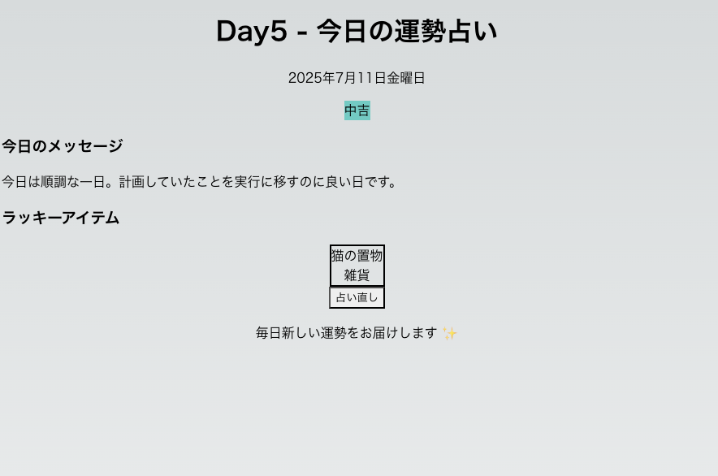

# Day5 - 今日の運勢占い

## 概要

毎日異なる運勢とラッキーアイテムを表示する占いアプリケーション。
日付ベースのランダム生成により、同じ日は同じ結果を表示します。

## 機能

- 今日の運勢表示（大吉、中吉、小吉、末吉、凶）
- ラッキーアイテム表示
- 運勢コメント表示
- 日付変更で自動更新

## 技術スタック

- Next.js 15
- React 18
- TypeScript
- SQLite3 (better-sqlite3)

## セットアップ方法

```bash
cd day005_fortune_app
npm install
npm run dev
```

## 使い方

1. ブラウザで http://localhost:3001 にアクセス
2. 今日の運勢とラッキーアイテムが表示されます
3. 日付が変わると自動で新しい運勢が生成されます

## データ構造

- fortune_levels: 運勢レベル（大吉、中吉など）
- fortune_comments: 運勢コメント
- lucky_items: ラッキーアイテム

## 作成日

2025年7月11日

## イメージ

