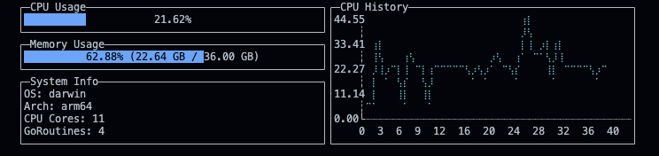

# day007_sysmon-go

リアルタイムでシステム情報を表示するターミナルUIツール

## 概要

Golangで実装したシステムモニターです。CPU使用率、メモリ使用率、システム情報をターミナル上でリアルタイムに表示します。

## 機能

- CPU使用率のリアルタイム表示（ゲージ＆グラフ）
- メモリ使用率の表示（使用量/総容量）
- システム情報表示（OS、アーキテクチャ、CPUコア数など）
- 1秒ごとの自動更新

## セットアップ方法

```bash
go mod download
```

## 使い方

```bash
go run main.go
```

操作方法:

- `q` または `Ctrl+C` で終了

## 使用技術

- Go 1.20+
- termui v3 - ターミナルUI描画
- gopsutil v3 - システム情報取得

## スクリーンショット

