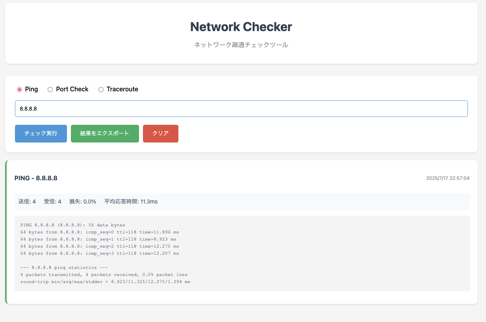

# Network Checker

ネットワーク疎通チェックを行うElectronベースのGUIアプリケーション

## 概要

- **Ping**: ホストの生死確認と応答時間測定
- **Port Check**: 特定ポートの開放状況チェック
- **Traceroute**: ネットワーク経路の追跡

## スクリーンショット



アプリケーションの動作例：
- Google DNS（8.8.8.8）へのPingテスト
- 同サーバーのポート53（DNS）の開放確認
- 結果の履歴表示とエクスポート機能

## 機能

### 基本機能
- Pingテスト（応答時間、パケット損失率の表示）
- ポートチェック（TCPポートの開放確認）
- Traceroute（ネットワーク経路の表示）

### 結果表示
- リアルタイムでの結果表示
- 成功/失敗の色分け表示
- 統計情報の表示（Pingの場合）

### エクスポート機能
- 結果をJSONファイルで保存
- 実行履歴の管理

## セットアップ方法

### 前提条件
- Node.js 18以上
- npm

### インストール
```bash
npm install
```

### ビルド
```bash
npm run build
```

### 実行
```bash
npm start
```

## 使い方

1. アプリケーションを起動
2. チェックタイプを選択（Ping/Port Check/Traceroute）
3. ホスト名またはIPアドレスを入力
4. ポートチェックの場合はポート番号も入力
5. 「チェック実行」ボタンをクリック
6. 結果が画面に表示される
7. 必要に応じて結果をエクスポート

## 対応OS

- Windows（Windows 10以降）
- macOS（macOS 10.15以降）
- Linux（Ubuntu 20.04以降）

## 技術スタック

- **フレームワーク**: Electron
- **言語**: TypeScript
- **UI**: React + CSS
- **ビルドツール**: TypeScript Compiler, Webpack
- **パッケージマネージャー**: npm

## 改善予定

- [ ] 定期的な自動チェック機能
- [ ] 結果のグラフ表示
- [ ] 設定のカスタマイズ機能
- [ ] 通知機能（アラート設定）
- [ ] 複数ホストの同時チェック