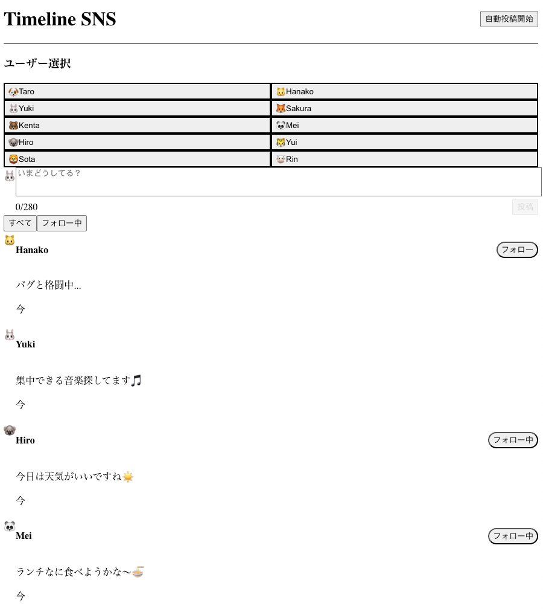

# Timeline SNS

リアルタイムで更新されるタイムライン機能を持つシンプルなSNSアプリケーション

## 概要

Next.js (App Router) とTypeScriptで構築されたタイムラインSNSアプリです。複数のユーザーを切り替えながら投稿やフォローができ、Server-Sent Events (SSE) を使用してリアルタイムにタイムラインが更新されます。

## 機能

- **投稿機能**: 選択したユーザーとして短いテキストメッセージを投稿
- **タイムライン表示**: 新しい順に投稿を表示（カーソルベースページネーション対応）
- **ユーザー切り替え**: 10人の仮ユーザーから選択して投稿
- **フォロー機能**: 他のユーザーをフォロー/フォロー解除
- **フィルタリング**: 全投稿表示とフォロー中のユーザーの投稿のみ表示を切り替え
- **リアルタイム更新**: SSEを使用して新規投稿を自動的にタイムラインに追加
- **自動投稿機能**: 開発用に5秒ごとにランダムな投稿を自動生成
- **アニメーション**: 新規投稿追加時のフェードインアニメーション

## セットアップ方法

```bash
# 依存関係のインストール
npm install

# 開発サーバーの起動
npm run dev
```

ブラウザで http://localhost:3000 を開きます。

## 使い方

1. **ユーザー選択**: 左側のユーザー一覧から投稿したいユーザーを選択
2. **投稿**: テキストエリアにメッセージを入力して「投稿」ボタンをクリック
3. **フォロー**: 各投稿の「フォロー」ボタンでユーザーをフォロー
4. **フィルタリング**: 「すべて」「フォロー中」タブで表示を切り替え
5. **自動投稿**: ヘッダーの「自動投稿開始」ボタンで自動投稿を有効化

## 技術スタック

- Next.js 15 (App Router)
- TypeScript
- Tailwind CSS
- Server-Sent Events (SSE)
- In-memory データベース

## スクショ

