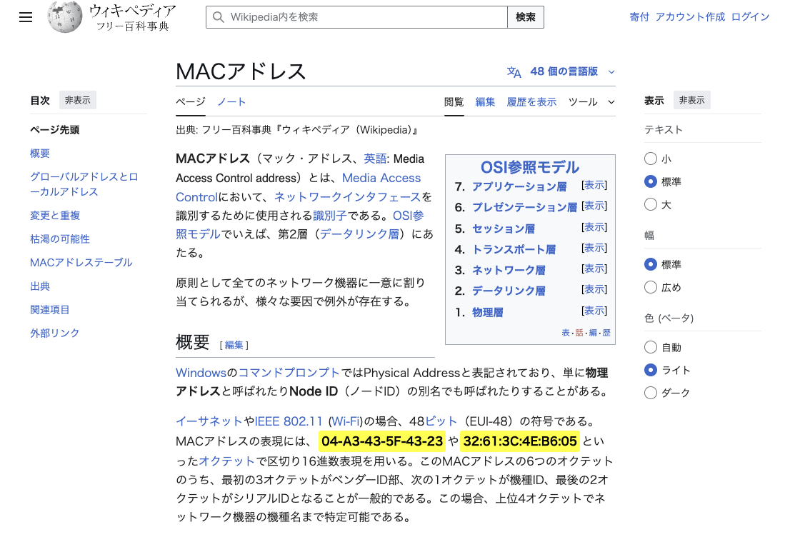

# MAC Address Highlighter

MACアドレスをWebページ上で自動的に検出してハイライト表示するChrome拡張機能です。

## 概要（What）

この拡張機能は、Webページ内のテキストからMACアドレスを自動的に検出し、視覚的にハイライト表示します。ネットワーク関連のドキュメントやログファイルを閲覧する際に、MACアドレスを素早く見つけることができます。

### 対応するMACアドレス形式

- **標準形式**: `XX:XX:XX:XX:XX:XX` (例: `00:1B:44:11:3A:B7`)
- **ハイフン区切り**: `XX-XX-XX-XX-XX-XX` (例: `00-1B-44-11-3A-B7`)
- **Cisco形式**: `XXXX.XXXX.XXXX` (例: `001B.4411.3AB7`)
- **区切りなし**: `XXXXXXXXXXXX` (例: `001B44113AB7`)

## セットアップ方法（How to install）

1. このディレクトリ（`day014_mac-address-highlighter`）をローカルに保存します

2. Chrome ブラウザを開き、アドレスバーに `chrome://extensions/` と入力します

3. 右上の「デベロッパーモード」をオンにします

4. 「パッケージ化されていない拡張機能を読み込む」をクリックします

5. `day014_mac-address-highlighter` ディレクトリを選択します

6. 拡張機能が正常に読み込まれると、ツールバーに「MAC」アイコンが表示されます

## 使い方（How to use）

### 基本的な使用方法

1. **自動ハイライト**: 拡張機能をインストールすると、訪問するすべてのWebページでMACアドレスが自動的にハイライト表示されます

2. **ポップアップメニュー**: ツールバーの「MAC」アイコンをクリックすると、以下の操作ができます：
   - **Enable Highlighting**: トグルスイッチでハイライト機能のON/OFFを切り替え
   - **Highlight Color**: カラーピッカーでハイライトの色を変更
   - **MAC Addresses Found**: 現在のページで検出されたMACアドレスの数を表示

### 使用例

- ネットワーク設定ドキュメントの確認
- ログファイルの分析
- ネットワーク機器の設定情報の確認
- トラブルシューティング時のMACアドレス特定

### 設定の保存

- ハイライトのON/OFF状態と選択した色は自動的に保存されます
- 次回ブラウザを開いた時も同じ設定が適用されます

## 技術仕様

- **Manifest Version**: 3
- **権限**: activeTab, storage
- **対応ブラウザ**: Google Chrome

## トラブルシューティング

- **ハイライトが表示されない場合**:
  1. 拡張機能が有効になっているか確認してください
  2. ページをリロードしてみてください
  3. ポップアップでハイライトがONになっているか確認してください

- **一部のサイトで動作しない場合**:
  - 動的に生成されるコンテンツでは、ページ読み込み後に追加されたMACアドレスは検出されない場合があります

## アイコンの作成について

アイコンを手動で作成する必要がある場合は、`create_icons.html`をブラウザで開き、各キャンバスを右クリックして画像として保存してください。

## 改善予定

- 動的に追加されるコンテンツへの対応
- ハイライトしたMACアドレスのコピー機能
- 検出パターンのカスタマイズ機能
- エクスポート機能（検出したMACアドレスのリスト出力）

## スクリーンショット

