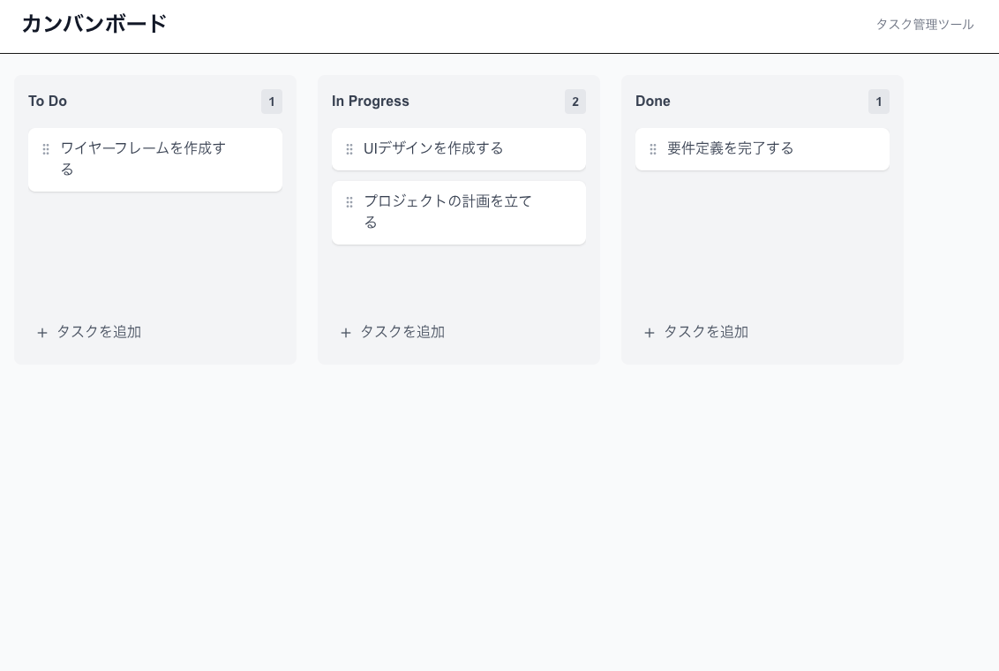

# カンバンボード (Kanban Board)

ドラッグ&ドロップ対応のタスク管理ツールです。TypeScriptとNext.js App Routerを使用して構築されています。

## 概要

- **ドラッグ&ドロップ**: タスクを列間で自由に移動可能
- **タスク管理**: タスクの追加、編集、削除が可能
- **レスポンシブデザイン**: モバイルとデスクトップに対応
- **リアルタイム更新**: 変更が即座に反映

## 技術スタック

- **Next.js 15** (App Router)
- **TypeScript**
- **Tailwind CSS**
- **@dnd-kit** (ドラッグ&ドロップライブラリ)
- **Lucide React** (アイコン)

## セットアップ方法

### 依存関係のインストール

```bash
npm install
```

### 開発サーバーの起動

```bash
npm run dev
```

ブラウザで [http://localhost:3000](http://localhost:3000) を開いてアプリケーションを確認できます。

## 使い方

1. **タスクの追加**: 各列の「タスクを追加」ボタンをクリック
2. **タスクの編集**: タスクカードの編集アイコンをクリック
3. **タスクの削除**: タスクカードの削除アイコンをクリック
4. **タスクの移動**: タスクをドラッグして他の列にドロップ

## 機能

- ✅ 3つの列（To Do, In Progress, Done）
- ✅ ドラッグ&ドロップによるタスク移動
- ✅ タスクの追加・編集・削除
- ✅ レスポンシブデザイン
- ✅ ホバーエフェクト
- ✅ キーボードショートカット対応

## 改善予定

- [ ] タスクの優先度設定
- [ ] 期限設定機能
- [ ] ラベル・タグ機能
- [ ] データの永続化（LocalStorage/Database）
- [ ] ユーザー認証
- [ ] チーム共有機能

## スクリーンショット

