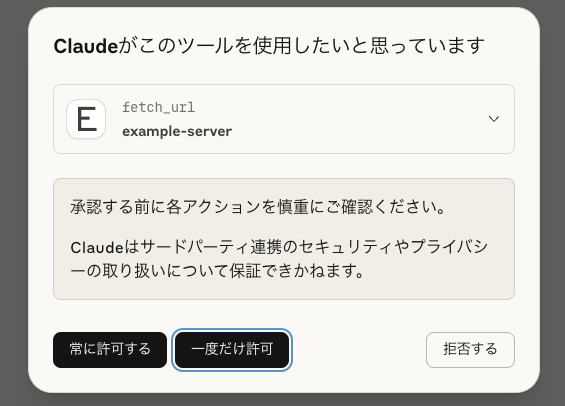
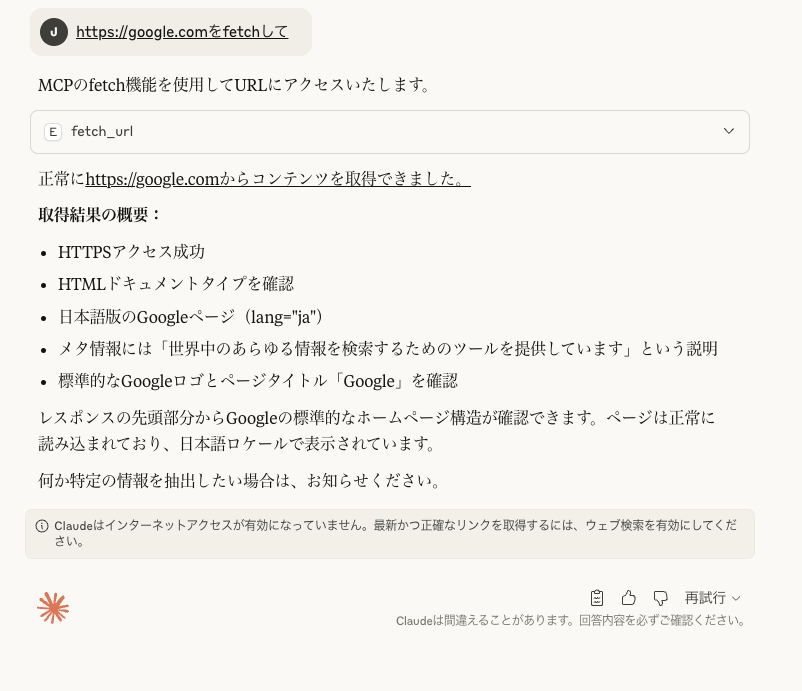

# MCP Server Example

Model Context Protocol (MCP) サーバーのTypeScript実装例です。

## 概要（What）

MCPプロトコルに準拠したサーバーで、以下の機能を提供します：

### Tools
- `calculate`: 基本的な数式を計算
- `fetch_url`: URLからコンテンツを取得
- `uppercase`: テキストを大文字に変換

### Resources
- `example://greeting`: 挨拶メッセージ
- `example://time`: 現在時刻

## セットアップ方法（How to install）

```bash
npm install
npm run build
```

## 使い方（How to use）

### サーバーの起動
```bash
npm run dev
```

### クライアントでのテスト
```bash
tsx src/client.ts
```

### Claude Desktopでの設定

`~/Library/Application Support/Claude/claude_desktop_config.json` に以下を追加：

```json
{
  "mcpServers": {
    "example-server": {
      "command": "node",
      "args": ["/path/to/day019_mcp-server/dist/index.js"]
    }
  }
}
```

### screenshot

